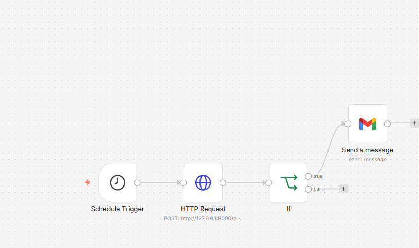
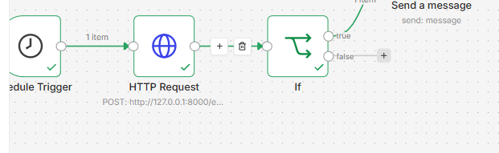
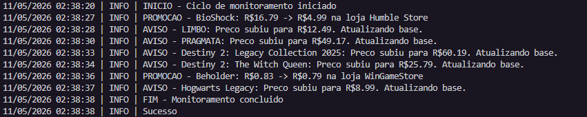
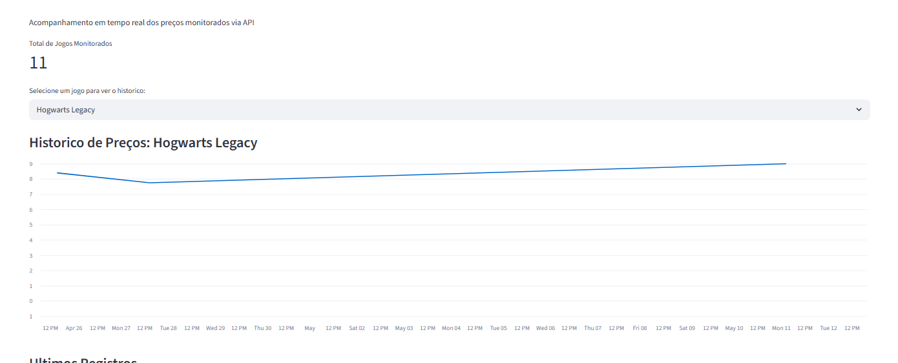
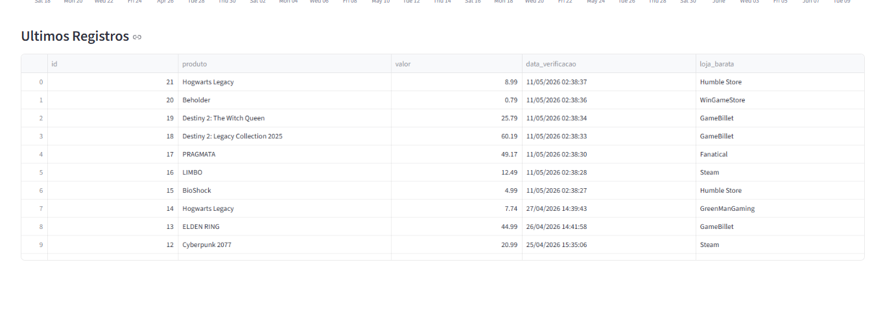
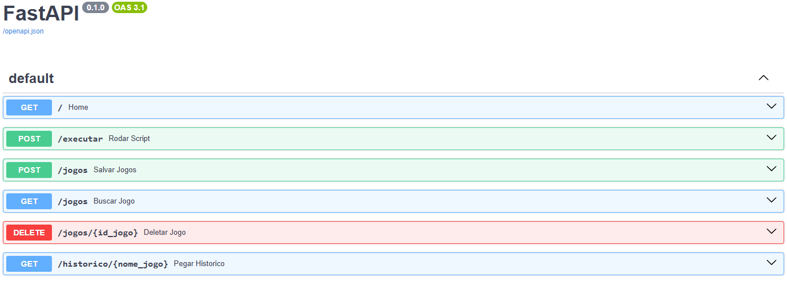
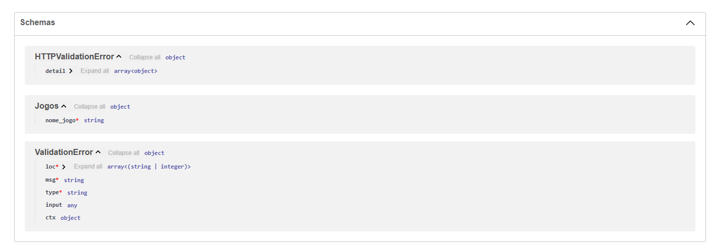

# 🎮 SentinelLog — Monitor de Preços de Jogos

[English](README.md) | [Português do Brasil](README.pt-BR.md)


> Pipeline ETL em Python que monitora preços de jogos em tempo real via API REST, detecta variações automaticamente e envia alertas por email quando encontra promoções.

---

## 📌 Sobre o Projeto

O SentinelLog nasceu da ideia de não perder promoções de jogos. Ele consulta a [CheapShark API](https://www.cheapshark.com/), compara os preços com o histórico salvo no banco de dados e, quando detecta uma queda de preço, dispara um alerta automaticamente via N8N.

O projeto foi construído com foco em escalabilidade e boas práticas — separação de responsabilidades em camadas, logging estruturado com rotação diária, e automação de ponta a ponta sem intervenção manual.

Hoje o SentinelLog está sendo preparado para produção real, incrementando robustez a cada sprint. Além de um monitor de preços, ele é uma API de monitoramento completa — transformando uma automação simples em um projeto real e escalável.

---

## 🚀 Tecnologias

| Tecnologia | Uso |
|---|---|
| Python | Linguagem principal |
| FastAPI + Uvicorn | API para expor o monitor como serviço |
| PostgreSQL | Persistência do histórico de preços |
| psycopg2 | Conector Python → PostgreSQL |
| Streamlit | Dashboard interativo de visualização |
| N8N | Orquestração e envio de emails |
| Docker + Docker Compose | Containerização dos serviços |
| python-dotenv | Gerenciamento de variáveis de ambiente |
| Requests | Consumo da API externa |

---

## 🏗️ Arquitetura

```
N8N Schedule Trigger
      ↓
HTTP POST /executar (FastAPI)
      ↓
sentinel_price.py — busca e compara preços
      ↓
CheapShark API (preços em tempo real)
      ↓
PostgreSQL — salva apenas quando o preço muda
      ↓
Retorna promoções → N8N envia email
      ↓
Streamlit — Dashboard com histórico e gráficos
```

---

## ⚙️ Como Rodar

### Pré-requisitos
- Python 3.10+
- PostgreSQL instalado e rodando
- N8N instalado (local ou cloud)

### Instalação

```bash
# Clone o repositório
git clone https://github.com/Wellington-Roveder/SentinelLog-game-price-monitor.git
cd SentinelLog-game-price-monitor

# Instale as dependências
pip install -r requirements.txt

# Configure as variáveis de ambiente
cp .env.example .env
# Edite o .env com suas credenciais
```

### Variáveis de Ambiente

Crie um arquivo `.env` na raiz com:

```
DB_NAME=sentinel_log
CHEAPSHARK_URL=https://www.cheapshark.com/api/1.0
DB_USER=seu_usuario
DB_SENHA=sua_senha
DB_HOST=localhost
DB_PORT=5432
INTERNAL_API_KEY=sua_chave
```

> ⚠️ Crie o banco `sentinel_log` no PostgreSQL antes de rodar o projeto.

### Executando

```bash
# Rodar o monitor manualmente (teste local)
python main.py

# Subir a API
uvicorn api.my_api:app --reload --port 8001

# Rodar o dashboard
python -m streamlit run dashboard/app.py
```

### Com Docker

```bash
docker-compose up --build
```

---

## 🧠 Decisões Técnicas

**Por que PostgreSQL?**
Migrado do SQLite para suportar múltiplos usuários simultâneos, volume maior de dados e deploy em produção. A camada de banco ficou isolada no `db_manager.py`, tornando a migração transparente para o restante do sistema.

**Por que salvar só quando o preço muda?**
A lógica de comparação antes de inserir evita duplicatas desnecessárias no banco. Se o preço não mudou, nenhuma linha nova é criada — o banco só cresce quando há informação nova de verdade.

**Por que FastAPI como entrypoint?**
Permite que o N8N consuma o monitor via HTTP POST, desacoplando a execução do agendamento. O endpoint retorna as promoções encontradas, permitindo que o N8N decida se envia o email ou não com base na resposta.

**Por que N8N para os emails?**
Separar a orquestração do código Python deixa cada parte com sua responsabilidade. O Python monitora e detecta, o N8N decide e notifica.

**Por que Docker?**
Garante que o ambiente seja reproduzível em qualquer máquina — sem problemas de dependências ou configuração manual do banco.

**Preparação para deploy**
Foram implementados endpoints para gerenciar a lista de jogos monitorados sem derrubar a aplicação — inserir e remover jogos via API, além de um endpoint para consultar o histórico de preços fora do dashboard.

**ThreadedConnectionPool**
O pool de conexões trata conexões mortas automaticamente, reutilizando-as entre requisições. Isso evita a sobrecarga de autenticação e rede exigida para estabelecer uma conexão do zero, reduz a latência das requisições e preserva memória e processamento do servidor de banco de dados.

**Autenticação**
Cada endpoint exige autenticação via `x-api-key`, retornando os status HTTP corretos em caso de falha. Como os endpoints serão consumidos tanto pelo N8N quanto por usuários externos, o tratamento de segurança foi implementado desde o início. Melhorias futuras incluirão geração de tokens e refresh para uso em tempo real.

**Teste unitarios**
O uso de testes unitários garante a cobertura das mudanças nas regras de negócio. Para isso, foram implementados testes utilizando o framework Pytest em conjunto com o `unittest.mock`, por meio do uso de `MagicMock`, permitindo simular dependências e validar comportamentos de forma isolada e confiável.


---

## 📊 Dashboard

O dashboard Streamlit exibe:
- Total de jogos monitorados
- Gráfico de variação de preço por jogo
- Tabela com todos os registros salvos

```bash
python -m streamlit run dashboard/app.py
```

---

## 🐛 Dificuldades e Aprendizados

**Logger com rotação diária** — configurar o `TimedRotatingFileHandler` corretamente, evitar handlers duplicados com o guard `if not logger.handlers`, e entender que o arquivo fica travado enquanto o processo está rodando foram os principais desafios.

**Design do banco de dados** — a decisão entre usar `UNIQUE` com upsert versus inserção simples com validação na camada de serviço. A lógica ficou no `sentinel_price.py`, deixando o banco responsável apenas por persistir — mais limpo e escalável.

**Integração N8N + FastAPI** — entender o fluxo de dados entre o Schedule Trigger, o HTTP Request e o IF node para evitar spam de emails foi um aprendizado importante sobre orquestração de workflows.

**Migração SQLite → PostgreSQL** — adaptar o `db_manager.py` trocando `sqlite3` por `psycopg2`, ajustando placeholders de `?` para `%s` e `AUTOINCREMENT` para `SERIAL`. A camada de serviço não precisou de nenhuma alteração.

**Tratamento de erros HTTP** — entender que retornar `200 OK` com `{"status": "erro"}` no body não é o mesmo que retornar um erro HTTP real. Ferramentas como o N8N não conseguem tratar isso como falha — o status code correto é o que define o comportamento da automação.

**Pool de conexões** — migrar de uma conexão única no `__init__` para um `ThreadedConnectionPool` compartilhado, garantindo que a aplicação não quebre se o banco reiniciar e que múltiplas requisições simultâneas sejam atendidas corretamente.

---

## 🔮 Melhorias Futuras

- [x] Migração de SQLite para PostgreSQL
- [x] Containerização com Docker
- [x] Pool de conexões com `ThreadedConnectionPool`
- [x] Endpoint `GET /historico/{jogo}` para consultar preços via API
- [x] Gerenciamento de jogos via endpoint (`POST`, `GET`, `DELETE`)
- [ ] Cache de lojas com Redis
- [ ] Autenticação via tokens JWT com refresh
- [ ] Notificação via Telegram além do email
- [ ] Deploy em produção (Railway ou Render)
- [ ] Retry automático em caso de falha na requisição à CheapShark

---

## 📁 Estrutura do Projeto

```
SentinelLog-game-price-monitor/
├── api/
│   ├── client.py           # Cliente HTTP reutilizável
│   ├── game_api_client.py  # Integração com CheapShark API
│   └── my_api.py           # API FastAPI
├── dashboard/
│   └── app.py              # Dashboard Streamlit
├── database/
│   ├── connection.py       # Pool de conexões PostgreSQL
│   └── db_manager.py       # Gerenciamento do banco
├── services/
│   └── sentinel_price.py   # Lógica principal do monitor
├── utils/
│   └── logger.py           # Logger com rotação diária
├── logs/                   # Logs gerados (ignorado pelo git)
├── main.py                 # Entry point para teste local
├── Dockerfile.api          # Dockerfile da FastAPI
├── Dockerfile.dashboard    # Dockerfile do Streamlit
├── docker-compose.yml      # Orquestração dos containers
├── requirements.txt        # Dependências
├── .env.example            # Exemplo de variáveis de ambiente
└── .gitignore
```

---

### Prints de Execução

#### N8N



#### Logs


#### Streamlit



#### Documentação Swagger



---

## 👤 Autor

Feito por **Wellington Roveder**  
[LinkedIn](https://www.linkedin.com/in/wellington-roveder-04637b37b/) • [GitHub](https://github.com/Wellington-Roveder?tab=repositories)